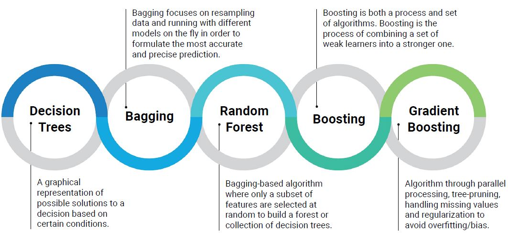
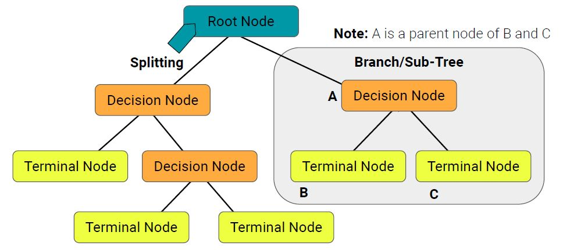
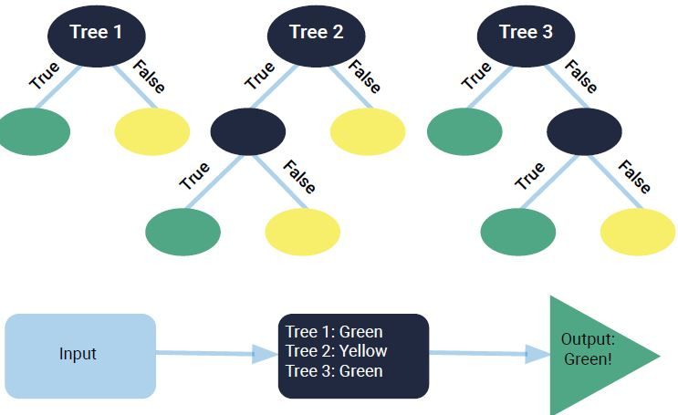

# Classification (Part. 2)

In this directory, we’ll learn about Tree Based Algorithms

1. Decision trees
2. Random forest
3. Weak learners
4. Ensemble methods

Cases examined:

* SBA loans encoding
* Predict Fraud with DecisionTreeClassifier
* Predict loan default using RandomForestClassifier
* Enpowering fraud detection algorithm using a GradientTreeClassifier

## TREE-BASED ALGORITHMS
----
are supervised learning methods that are mostly used for classifications and regression problems.

While in LINEAR MODELS, the relationship among variables can be represented in a straight line 
in NON-LINEAR MODELS, TREE-BASED ALGO. can be used to map the relationship in non-linear data.

Linear model example: 
Predicting the price of a house based on it's size, because the size of the house is directly proportional to the price of the house.

Non-Linear model example:
Predicting if a credit application is going to be fraudulent or not, because of the complex relationship between the input features & the output prediction.

Tree-Based Algo. example:
Assessing Risk, preventing fraud, fighting money laundering

### 1- SKlearn Module to implement tree-based algo.

    sklearn.tree

**Decision Tree** encodes a series of True or False questions that can be respresented by a series of IF/ELSE statements, decision-trees key conecepts:

  * ROOT NODE: represent the sample data, and can be divided into 2 or more homogenous sets.
  * PARENT NODE: that can be divided into sub-nodes
  * CHILD NODE: sub-nodes of a parent node
  * DECISION NODE: is the sub-node that is split into further sub-nodes
  * LEAF/TERMINAL NODE: nodes that don't split
  * SPLITTING: process of dividing a node into 2 or more sub-nodes
  * PRUNING: process of removing sub-nodes of a decision node
  * TREE'S DEPTH: the number of decision nodes encountered before making a decision.

### 2-  Sklearn Module that offers implementations for random forest, gradient boosting, boosting & bagging algo.

    sklearn.ensemble
When comapring the performance of classification algorithm, you will find that soem perform better than the others and this introduce us to the term 'WEAK LEARNERS'

**weak learners** are algorithm that fail at learning in an adequate fashion and their predictions are only a little better than random chance.

**Ensemble** is an entire set of algorithm that allow you to combine all WEAK LEARNERS in order to make a more accurate & robust prediction engine with minimal variance.

Specific Algorithm to combine weak learners:

  1. GradientBoositingTree
  2. XGBoost
  3. Random Forest

### 3- Random Algorithm: it's an alogrithum that will sample the data & build several smaller, simpler decision trees.
* Forset of Trees: is the simpler subset of the data of each tree in random forest, where each tree is a WEAK CLASSIFIER, but when combined together forms STRONG CLASSIFIER.

BEENFITS OF RANDOM ALGORITHM
  + Robust aganist overfitting
  + Can be used to rank the importance of input varaibles in a natural way
  + Can handle thousands of input variables without variable deletion
  + Robust to outliners & non-linear data
  + Runs efficiently on large datasets.

### 4- Boosting & Bagging.(XGBoost)
Both algorithms are used to improve the robustness & reliability of machine-learning models.
XGBoost are often the best performing in Kaggle machine-learning contests, their ability to make accurate predictions with precision & substantial recall is almost unparalleled.

**Bagging** 
focuses on resampling data & running with different models in order to formulate the most accurate & precise prediction. 
instead of sampling on number of features, bagging will sample in terms of number of observations

**Boosting**
it is the process of combining a set of weak learners into a stronger one, by sampling more heavily the obseravtions with worst predictions, the goal is to combine weak kearners into ensemble learners. It is both a process & set of algorithm.

### 5- Gradient Boosted Tree

    from sklearn.ensemble import GradientBoostingClassifier

### Gradient Boosted Tree has 3 main arguments:
* N_estimators = no. of weak learners being used with the boosting algo.
* Learning_rate = controls overfitting
* Max_depth = the size/depth of each decision tree.

### 6- TREE-BASED ALGO. VS OTHER CLASSIFICATIONS.

@ Easier to represent complex models
@ Can be used for Numerical or Categorical Data
@ Needs little data preparation
@ Can represent unnormal distributed data
@ Avoid overfitting
@ Classical classification can be faster
@ Logistic Regression may outperform decision trees & random forests in having a large number of features with low noise
@ SVM can handle linear & non-linear models

### 7- Conclusion:
Real World Classification Uses:

*FINANCE & BANKING :*
FRAUD DETECTION - MONEY LAUNDRY - CREDIT RISK ASSESSMENT.

*RETAIL & MARKETING :*
PRODUCT OFFERS & RECOMMENDATIONS BASED ON CUSTOMER BROWSING HISTORY & BEHAVIOUR.

*PLOITICS :*
VOTE INTENTION - PARTY AFFINITY.

*HEALTH :*
TRIALS TESTS - ILLS DIAGNOSIS.

*SECURITY :*
INTRUDERS DETECTION - PREDICTIVE MAINTENANCE.

*EDUACTION :*
PROGRAMS AFFINITY - DESERTION PREVENTION - CUSTOMIZED CURRICULA.

# References & Additional Resources:

* [Python Build-in Functions: enumerate](https://docs.python.org/3/library/functions.html)
* [RandomForestClassifier](https://scikit-learn.org/stable/modules/generated/sklearn.ensemble.RandomForestClassifier.html)
* [DecisonTreeClassifier](https://scikit-learn.org/stable/modules/generated/sklearn.tree.DecisionTreeClassifier.html)
* [Tree-Based Algorithm Explained](https://www.analyticsvidhya.com/blog/2016/04/tree-based-algorithms-complete-tutorial-scratch-in-python/#nine)
* [Differences between Bagging & Boosting](https://quantdare.com/what-is-the-difference-between-bagging-and-boosting/)
* [Flatten, Ravel, & Reshape functions](https://stackoverflow.com/questions/28930465/what-is-the-difference-between-flatten-and-ravel-functions-in-numpy)
* [Ravel function](https://stackoverflow.com/questions/28930465/what-is-the-difference-between-flatten-and-ravel-functions-in-numpy)

